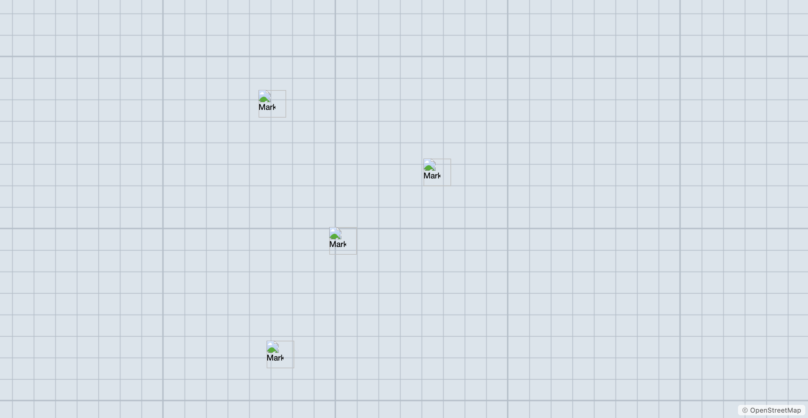
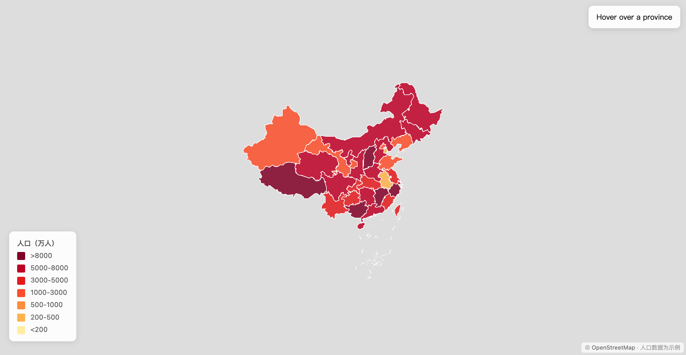

# open-leaflet-skill

Agent skill for generating interactive Leaflet.js map HTML components from natural language descriptions. Supports 2D maps, 3D buildings (OSMBuildings), map card popups/tooltips, visual effects, and choropleth visualization with built-in China province GeoJSON data.

> **For the skill definition (agent consumption), see [`SKILL.md`](./SKILL.md).**  
> This README is for humans browsing the repository.

---

## Installation (for Agent Users)

```bash
git clone https://github.com/archerzing-tech/open-leaflet-skill ~/.agents/skills/leaflet/
```

Supported agents: opencode, hermes, claude-code. The agent auto-loads `SKILL.md` from the root of this directory.

**Usage example for agents:**

> "把四川省高亮显示，用红色边框，点击弹出省会成都的数据指标卡片"  
> "显示上海陆家嘴的 3D 建筑场景"  
> "在成都标出宽窄巷子、锦里、熊猫基地三个景点，带图文卡片"  
> "做一个全国人口分级统计图，按省份用颜色深浅表示人口密度"

---

## Examples

### Province Highlight with Metric Card


Full file: `assets/examples/sichuan-highlight.html`

---

### Chengdu POIs with Image Cards



Full file: `assets/examples/chengdu-pois.html`

---

### Population Choropleth



Full file: `assets/examples/choropleth-population.html`

---

## Demos

| File | Description |
|------|-------------|
| `assets/leaf-demo.html` | Province highlight + hover/click interaction |
| `assets/leaf-effects.html` | Effects: mask, glow, pulse, marching ants, color transform |
| `assets/leaf-3d-demo.html` | 3D buildings (Shanghai/Beijing/Chengdu/Shenzhen) + height coloring |
| `assets/leaf-card-demo.html` | 6 POI cards + province metric card in 3 modes (popup/tooltip/float) |

---

## Directory Structure

```
open-leaflet-skill/               # GitHub repo = agent skill root
├── README.md                     # Project intro (this file)
├── SKILL.md                      # Agent skill definition (searched by agents)
├── lib/                          # Leaflet 1.9.4 (local, no CDN)
│   ├── leaflet.css
│   └── leaflet.js
├── references/                   # Reference guides
├── data/                         # GeoJSON data
│   ├── china_provinces.geojson
│   ├── taiwan.geojson
│   ├── hongkong.geojson
│   └── macau.geojson
└── assets/                       # Demo HTML files + screenshots
    ├── leaf-demo.html
    ├── leaf-effects.html
    ├── leaf-3d-demo.html
    ├── leaf-card-demo.html
    └── examples/
        ├── sichuan-highlight.html
        ├── chengdu-pois.html
        ├── choropleth-population.html
        ├── screenshot-sichuan.png
        ├── screenshot-chengdu.png
        └── screenshot-choropleth.png
```

## Data Sources

- **China administrative boundaries**: DataV.GeoAtlas `https://geo.datav.aliyun.com/areas_v3/bound/{adcode}_full.json`
- **Global data**: OpenStreetMap Overpass API `https://overpass-api.de/api/interpreter`
- **3D buildings**: OSMBuildings `https://{s}.data.osmbuildings.org/0.2/59fcc2e8/tile/{z}/{x}/{y}.json`
- **Placeholder images**: picsum.photos

## License

MIT
