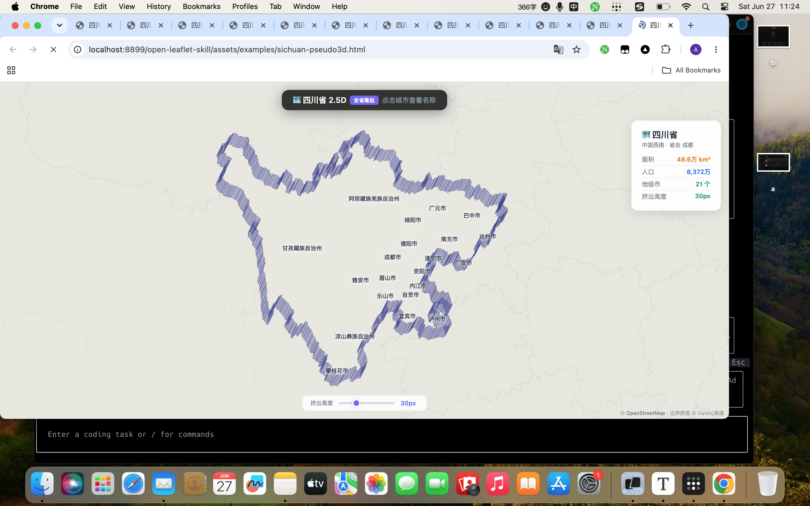

# open-leaflet-skill

Agent skill for generating interactive Leaflet.js map HTML components from natural language descriptions. Supports 2D maps, map card popups/tooltips, visual effects, and choropleth visualization with built-in China province GeoJSON data.

> **For the skill definition (agent consumption), see [`open-leaflet-skill/SKILL.md`](./open-leaflet-skill/SKILL.md).**  
> This README is for humans browsing the repository.

---

## Installation

### Prerequisites

- An AI agent that supports the [Agent Skills](https://agentskills.io) format (e.g., Claude Code, opencode, hermes, Cursor, Windsurf, or similar)
- Git

### Quick Install

Clone this repository into your agent's skills directory:

```bash
# Default skills directory for most agents
git clone https://github.com/archerzing-tech/open-leaflet-skill ~/.agents/skills/leaflet/
```

### Manual Install

If you prefer to place the skill elsewhere or don't use the default skills directory:

```bash
# Clone anywhere
git clone https://github.com/archerzing-tech/open-leaflet-skill

# Then configure your agent to point to the skill path.
# Most agents support a SKILL_PATH or similar config.
```

> ⚠️ **Important**: The skill root is the `open-leaflet-skill/` subdirectory inside this repo. When configuring your agent, make sure it points to `open-leaflet-skill/SKILL.md`.

### Verify Installation

After installation, verify the skill is available by checking:

```bash
ls ~/.agents/skills/leaflet/open-leaflet-skill/SKILL.md
```

Then ask your agent to "list available skills" — it should show **leaflet** (or **open-leaflet-skill**) in the list.

### Supported Agents

| Agent | Compatibility |
|-------|--------------|
| Claude Code | ✅ Full support — auto-loads `SKILL.md` from skill root |
| opencode | ✅ Full support |
| hermes | ✅ Full support |
| Cursor | ✅ Compatible (point to `open-leaflet-skill/SKILL.md`) |
| Windsurf | ✅ Compatible |

---

## Usage Examples

Send these prompts to your agent after the skill is installed:

> "把四川省高亮显示，用红色边框，点击弹出省会成都的数据指标卡片"  
> "在成都标出宽窄巷子、锦里、熊猫基地三个景点，带图文卡片"  
> "做一个全国人口分级统计图，按省份用颜色深浅表示人口密度"

---

## Examples

Each example below shows what you can say to your AI agent → the skill processes it → generates the corresponding map:

---

### 🏔️ Province Highlight with Metric Card

**👤 You say:**

> 把四川省高亮显示，用红色边框，点击弹出省会成都的数据指标卡片

**🤖 Skill generates:**


📄 [`open-leaflet-skill/assets/examples/sichuan-highlight.html`](./open-leaflet-skill/assets/examples/sichuan-highlight.html)

---

### 📍 Chengdu POIs with Image Cards

**👤 You say:**

> 在成都标出宽窄巷子、锦里、熊猫基地、武侯祠、杜甫草堂、青城山六个景点，每个带图文卡片展示

**🤖 Skill generates:**


📄 [`open-leaflet-skill/assets/examples/chengdu-pois.html`](./open-leaflet-skill/assets/examples/chengdu-pois.html)

---

### 🗺️ Population Choropleth

**👤 You say:**

> 做一个全国人口分级统计图，按省份用颜色深浅表示人口密度，加图例

**🤖 Skill generates:**


📄 [`open-leaflet-skill/assets/examples/choropleth-population.html`](./open-leaflet-skill/assets/examples/choropleth-population.html)

---

### 🏔️ 四川省 2.5D 隆起 + 市界分割

**👤 You say:**

> 做一个四川省的 2.5D 隆起地图，全省立体挤出，市界分割线清晰可见，可调节挤出高度

**🤖 Skill generates:**



📄 [`open-leaflet-skill/assets/examples/sichuan-pseudo3d.html`](./open-leaflet-skill/assets/examples/sichuan-pseudo3d.html)

> 全省统一 `#6366f1` 紫色挤出 · 白色市界分割线 · 21 城市名称标签 · 高度滑块 10–80px · 地图平视无倾斜

---

### All Demo Files

| File | Description |
|------|-------------|
| `open-leaflet-skill/assets/leaf-demo.html` | Province highlight + hover/click interaction |
| `open-leaflet-skill/assets/leaf-effects.html` | Effects: mask, glow, pulse, marching ants, color transform |
| `open-leaflet-skill/assets/leaf-card-demo.html` | 6 POI cards + province metric card in 3 modes (popup/tooltip/float) |
| `open-leaflet-skill/assets/examples/sichuan-highlight.html` | Province highlight with metric card |
| `open-leaflet-skill/assets/examples/chengdu-pois.html` | 6 Chengdu POIs with image cards |
| `open-leaflet-skill/assets/examples/choropleth-population.html` | Population choropleth by province |
| `open-leaflet-skill/assets/examples/sichuan-pseudo3d.html` | Sichuan 2.5D unified extrusion with city boundary lines |

---

## Directory Structure

```
open-leaflet-skill/                       # Project root
├── README.md                             # Project intro (this file)
├── pics/                                 # Screenshots for README
│   ├── screenshot-sichuan.png
│   ├── screenshot-chengdu.png
│   ├── screenshot-choropleth.png
└── open-leaflet-skill/                   # Agent skill root (agentskills.io spec)
    ├── SKILL.md                          # Required: metadata + instructions
    ├── scripts/                          # Optional: executable code
    ├── references/                       # Optional: reference guides
    │   ├── leaflet-quickstart.md
    │   ├── geojson-guide.md
    │   ├── choropleth-guide.md
    │   ├── api-reference.md
    │   ├── best-practices.md
    │   ├── data-sources.md
    │   ├── effects-guide.md
    │   ├── 3d-buildings-guide.md
    │   ├── tooltip-card-guide.md
    │   └── real-world-examples.md
    └── assets/                           # Optional: static resources
        ├── leaf-demo.html
        ├── leaf-effects.html
        ├── leaf-card-demo.html
        ├── examples/
        │   ├── sichuan-highlight.html
        │   ├── chengdu-pois.html
        │   ├── choropleth-population.html
        │   └── sichuan-pseudo3d.html
        ├── data/                         # GeoJSON data
        │   ├── china_provinces.geojson
        │   ├── taiwan.geojson
        │   ├── hongkong.geojson
        │   └── macau.geojson
        └── lib/                          # Leaflet 1.9.4 (local)
            ├── leaflet.css
            └── leaflet.js
```

## Data Sources

本技能支持多通道 GeoJSON 数据获取，针对中国网络环境优化：

| 渠道 | 国内访问 | 推荐场景 |
|------|---------|---------|
| DataV.GeoAtlas `geo.datav.aliyun.com` | ✅ 极快 | 实时加载（首选） |
| GeoJSON.cn `geojson.cn` | ✅ 极快 | 离线/批量获取 |
| 天地图 `api.tianditu.gov.cn` | ✅ 极快 | 官方合规数据 |
| 本地文件 `assets/data/` | ✅ 无网络 | 离线/稳定需求 |
| jsDelivr CDN `cdn.jsdelivr.net` | ✅ 较快 | GitHub 仓库加速 |
| Overpass API（全球） | ⚠️ 可能受限 | 仅备选 |

> 完整参考 → [`open-leaflet-skill/references/data-sources.md`](./open-leaflet-skill/references/data-sources.md)，含坐标系转换、多通道 fallback 策略、adcode 对照表。

## License

MIT
