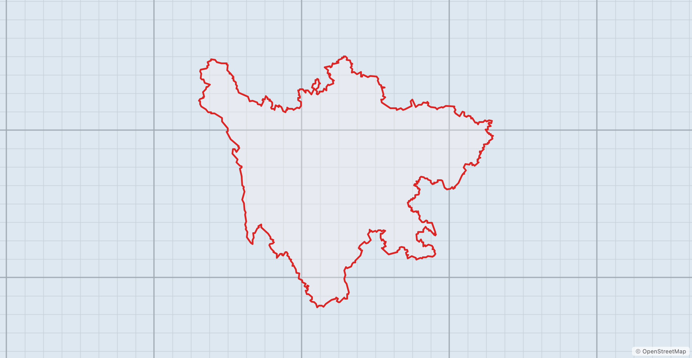
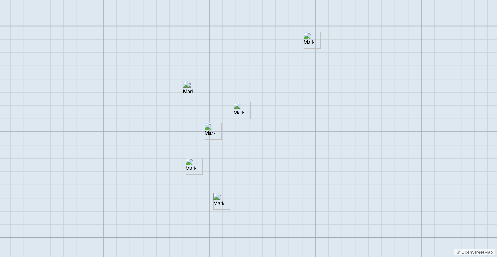
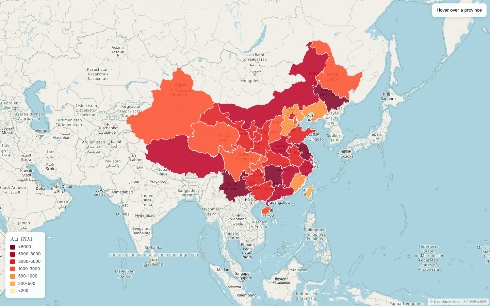
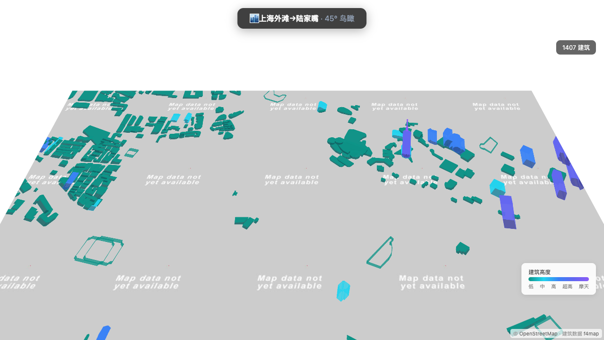
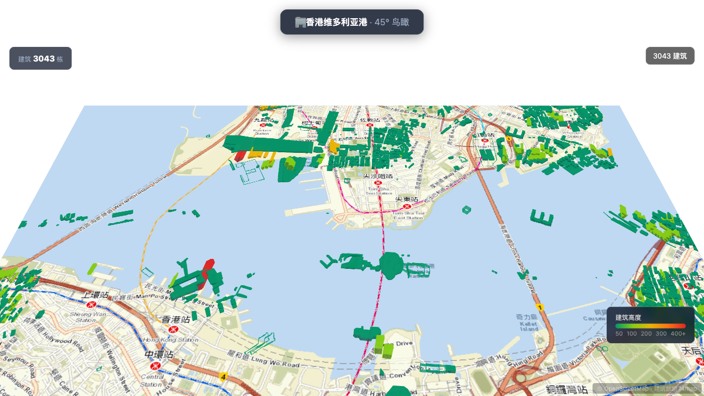
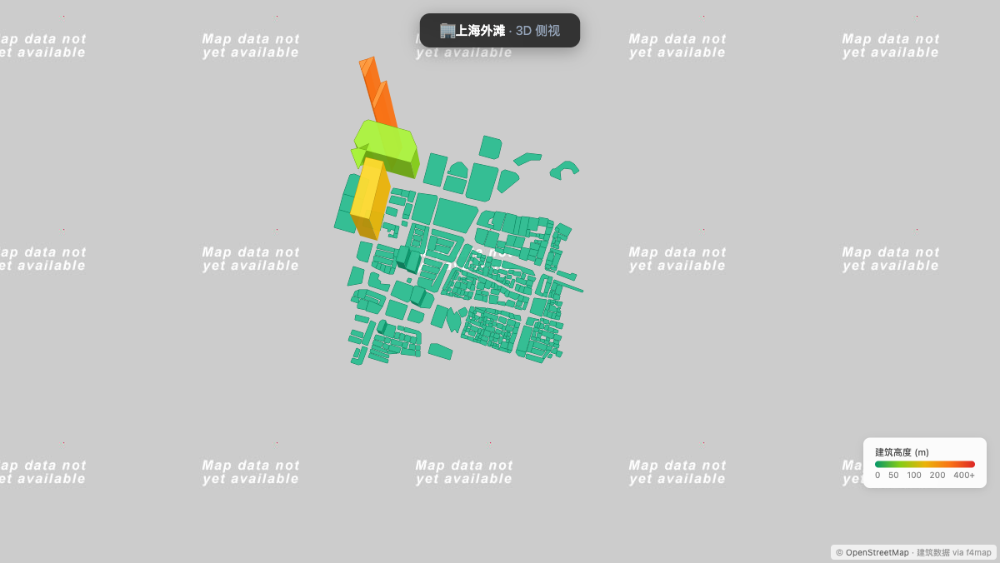

# open-leaflet-skill

Agent skill for generating interactive Leaflet.js map HTML components from natural language descriptions. Supports 2D maps, 3D buildings (f4map polygon extrusion), map card popups/tooltips, visual effects, and choropleth visualization with built-in China province GeoJSON data.

> **For the skill definition (agent consumption), see [`open-leaflet-skill/SKILL.md`](./open-leaflet-skill/SKILL.md).**  
> This README is for humans browsing the repository.

---

## Installation

### Prerequisites

- An AI agent that supports the [Agent Skills](https://agentskills.io) format (e.g., Claude Code, opencode, hermes, Cursor, Windsurf, or similar)
- Git

### Quick Install

Clone this repository into your agent's skills directory:

```bash
# Default skills directory for most agents
git clone https://github.com/archerzing-tech/open-leaflet-skill ~/.agents/skills/leaflet/
```

### Manual Install

If you prefer to place the skill elsewhere or don't use the default skills directory:

```bash
# Clone anywhere
git clone https://github.com/archerzing-tech/open-leaflet-skill

# Then configure your agent to point to the skill path.
# Most agents support a SKILL_PATH or similar config.
```

> ⚠️ **Important**: The skill root is the `open-leaflet-skill/` subdirectory inside this repo. When configuring your agent, make sure it points to `open-leaflet-skill/SKILL.md`.

### Verify Installation

After installation, verify the skill is available by checking:

```bash
ls ~/.agents/skills/leaflet/open-leaflet-skill/SKILL.md
```

Then ask your agent to "list available skills" — it should show **leaflet** (or **open-leaflet-skill**) in the list.

### Supported Agents

| Agent | Compatibility |
|-------|--------------|
| Claude Code | ✅ Full support — auto-loads `SKILL.md` from skill root |
| opencode | ✅ Full support |
| hermes | ✅ Full support |
| Cursor | ✅ Compatible (point to `open-leaflet-skill/SKILL.md`) |
| Windsurf | ✅ Compatible |

---

## Usage Examples

Send these prompts to your agent after the skill is installed:

> "把四川省高亮显示，用红色边框，点击弹出省会成都的数据指标卡片"  
> "显示上海陆家嘴的 3D 建筑场景"  
> "在成都标出宽窄巷子、锦里、熊猫基地三个景点，带图文卡片"  
> "做一个全国人口分级统计图，按省份用颜色深浅表示人口密度"

---

## Examples

Each example below shows what you can say to your AI agent → the skill processes it → generates the corresponding map:

---

### 🏔️ Province Highlight with Metric Card

**👤 You say:**

> 把四川省高亮显示，用红色边框，点击弹出省会成都的数据指标卡片

**🤖 Skill generates:**



📄 [`open-leaflet-skill/assets/examples/sichuan-highlight.html`](./open-leaflet-skill/assets/examples/sichuan-highlight.html)

---

### 📍 Chengdu POIs with Image Cards

**👤 You say:**

> 在成都标出宽窄巷子、锦里、熊猫基地、武侯祠、杜甫草堂、青城山六个景点，每个带图文卡片展示

**🤖 Skill generates:**



📄 [`open-leaflet-skill/assets/examples/chengdu-pois.html`](./open-leaflet-skill/assets/examples/chengdu-pois.html)

---

### 🗺️ Population Choropleth

**👤 You say:**

> 做一个全国人口分级统计图，按省份用颜色深浅表示人口密度，加图例

**🤖 Skill generates:**



📄 [`open-leaflet-skill/assets/examples/choropleth-population.html`](./open-leaflet-skill/assets/examples/choropleth-population.html)

---

### 🏙️ Shanghai Lujiazui 3D Skyline

**👤 You say:**

> 显示上海陆家嘴的 3D 建筑天际线，带建筑信息卡片，点击可查看高度/楼层

**🤖 Skill generates:**



📄 [`open-leaflet-skill/assets/examples/shanghai-3d.html`](./open-leaflet-skill/assets/examples/shanghai-3d.html)

---

### 🏗️ Shenzhen Futian 3D Height Coloring

**👤 You say:**

> 展示深圳福田区的 3D 建筑场景，用颜色表示建筑高度，点击查看高度信息

**🤖 Skill generates:**


📄 [`open-leaflet-skill/assets/examples/shenzhen-3d.html`](./open-leaflet-skill/assets/examples/shenzhen-3d.html)

---

### 🏢 Hong Kong Central 3D Skyscrapers

**👤 You say:**

> 展示香港中环的摩天大楼 3D 场景，不同高度用不同颜色表示，点击查看建筑详情

**🤖 Skill generates:**



📄 [`open-leaflet-skill/assets/examples/hongkong-3d.html`](./open-leaflet-skill/assets/examples/hongkong-3d.html)

---

## Demos

### 🚁 直升机视角 3D 城市漫游

**👤 You say:**

> 显示上海陆家嘴的 3D 建筑天际线，带直升机倾斜视角，点击查看建筑信息

**🤖 Skill generates:**



📄 [`open-leaflet-skill/assets/leaf-3d-demo.html`](./open-leaflet-skill/assets/leaf-3d-demo.html)

> 支持 3 个城市（上海金茂中心/香港维多利亚港/重庆解放碑），OSMBuildings + 本地 GeoJSON 建筑数据。
> 点击建筑查看高度/楼层，快捷键 `1`-`3` 切换城市, `S` 切换视角。

---

### All Demo Files

| File | Description |
|------|-------------|
| `open-leaflet-skill/assets/leaf-3d-demo.html` | 3D city helicopter view (3 cities: Shanghai/HK/Chongqing) |
| `open-leaflet-skill/assets/leaf-demo.html` | Province highlight + hover/click interaction |
| `open-leaflet-skill/assets/leaf-effects.html` | Effects: mask, glow, pulse, marching ants, color transform |
| `open-leaflet-skill/assets/leaf-card-demo.html` | 6 POI cards + province metric card in 3 modes (popup/tooltip/float) |
| `open-leaflet-skill/assets/examples/shanghai-3d.html` | Shanghai Jin Mao 3D helicopter view |
| `open-leaflet-skill/assets/examples/hongkong-3d.html` | Hong Kong Victoria Harbour 3D helicopter view |
| `open-leaflet-skill/assets/examples/chongqing-3d.html` | Chongqing Jiefangbei 3D helicopter view |
| `open-leaflet-skill/assets/examples/shenzhen-3d.html` | Shenzhen 3D height coloring |

---

## Directory Structure

```
open-leaflet-skill/                       # Project root
├── README.md                             # Project intro (this file)
├── pics/                                 # Screenshots for README
│   ├── screenshot-sichuan.png
│   ├── screenshot-chengdu.png
│   ├── screenshot-choropleth.png
│   ├── screenshot-shanghai-3d.png
│   ├── screenshot-shenzhen-3d.png
│   └── screenshot-hongkong-3d.png
└── open-leaflet-skill/                   # Agent skill root (agentskills.io spec)
    ├── SKILL.md                          # Required: metadata + instructions
    ├── scripts/                          # Optional: executable code
    ├── references/                       # Optional: reference guides
    │   ├── leaflet-quickstart.md
    │   ├── geojson-guide.md
    │   ├── choropleth-guide.md
    │   ├── api-reference.md
    │   ├── best-practices.md
    │   ├── data-sources.md
    │   ├── effects-guide.md
    │   ├── 3d-buildings-guide.md
    │   ├── tooltip-card-guide.md
    │   └── real-world-examples.md
    └── assets/                           # Optional: static resources
        ├── leaf-demo.html
        ├── leaf-effects.html
        ├── leaf-3d-demo.html
        ├── leaf-card-demo.html
        ├── examples/
        │   ├── sichuan-highlight.html
        │   ├── chengdu-pois.html
        │   ├── choropleth-population.html
        │   ├── shanghai-3d.html
        │   ├── shenzhen-3d.html
        │   ├── hongkong-3d.html
        │   └── chongqing-3d.html
        ├── data/                         # GeoJSON data
        │   ├── china_provinces.geojson
        │   ├── taiwan.geojson
        │   ├── hongkong.geojson
        │   ├── macau.geojson
        │   └── 3d/                          # 3D building data
        │       ├── shanghai/buildings.json
        │       ├── shenzhen/buildings.json
        │       ├── hongkong/buildings.json
        │       └── chongqing/buildings.json
        └── lib/                          # Leaflet 1.9.4 (local)
            ├── leaflet.css
            └── leaflet.js
```

## Data Sources

- **China administrative boundaries**: DataV.GeoAtlas `https://geo.datav.aliyun.com/areas_v3/bound/{adcode}_full.json`
- **Global data**: OpenStreetMap Overpass API `https://overpass-api.de/api/interpreter`
- **3D buildings**: [f4map](https://f4map.com) Buildings Tile API (`buildings.f4map.com`) — real-time OSM building data with heights, names, levels. Fallback: per-city GeoJSON in `assets/data/3d/`
- **Placeholder images**: picsum.photos

## License

MIT
